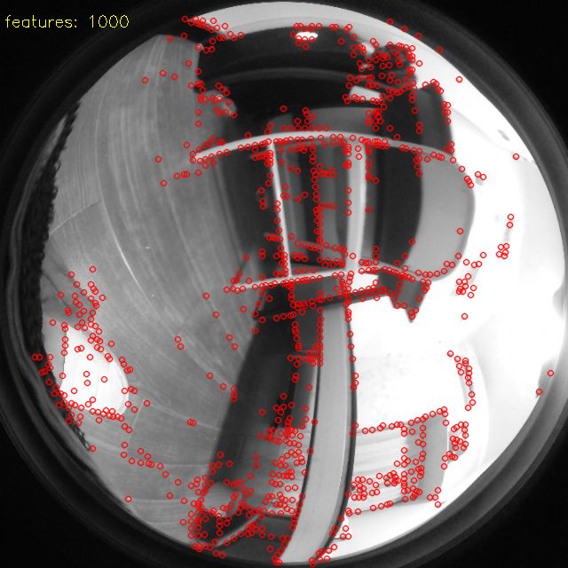

# xfeatc

C++ port of [XFeat](https://github.com/verlab/accelerated_features).

## Original work

- [accelerated_features (original repository)](https://github.com/verlab/accelerated_features/tree/main)

## Features

- Pre- and post-processing steps are carefully validated to match the original PyTorch implementation.
- The `InstanceNormalization` layer is moved from the model to the pre-processing step.
- Outputs are changed from `[B, C, H, W]` to `[B, H, W, C]` to speed up post-processing.
- Uses `FastExp` instead of `std::exp` to accelerate softmax.

## Usage

### 1) Prepare ONNX Runtime

Download `onnxruntime-linux-x64-gpu-1.22.0` for Ubuntu 22.04 from the [ONNX Runtime releases page](https://github.com/microsoft/onnxruntime/releases) and extract it.

### 2) Build

```bash
mkdir -p build
cd build
cmake .. -DONNXRUNTIME_ROOT=/home/user/software/onnxruntime-linux-x64-gpu-1.22.0
make -j3
```

### 3) Run

Sample inputs are provided in the `data/` folder.

- `DetectDemo`
- `MatchDemo`
- `FlowDemo`
- `WebcamMatchDemo` (three-panel view: reference, live feed, and match visualization)

Examples:

```bash
./DetectDemo
./MatchDemo
```

Image example:



> Note: The exported ONNX model in this repository expects input size `1x1x640x640` (grayscale 640x640). The demos currently support only this size. To support other sizes, export your own ONNX model using the Python code below.

## Export ONNX

If you want to export ONNX from PyTorch, you can use the following script:

```python
import torch
from modules.xfeat import XFeatModel
import onnxruntime as ort

# os.environ['CUDA_VISIBLE_DEVICES'] = ''  # Force CPU, comment out for GPU

# Set the model to evaluation mode
net = XFeatModel().eval()

# Load pretrained weights
net.load_state_dict(torch.load("weights/xfeat.pt", map_location=torch.device('cpu')))

# Random input
x = torch.randn(1, 1, 640, 640)

# Export to ONNX
torch.onnx.export(
    net,
    x,
    "xfeat.onnx",
    verbose=True,
    input_names=["input"],
    output_names=["output_feats", "output_keypoints", "output_heatmap"],
    opset_version=11,
)

print("ONNX model saved as xfeat.onnx")

# Check the ONNX model with onnxruntime
ort_session = ort.InferenceSession("xfeat.onnx")
print("ONNX model loaded successfully")

outputs = ort_session.run(None, {"input": x.numpy()})

# PyTorch model outputs
torch_outputs = net(x)

# Compare the outputs
for i in range(len(outputs)):
    print(f"onnx output shape {i}: {outputs[i].shape}")
    print(f"torch output shape {i}: {torch_outputs[i].shape}")
    print(f"Output {i} comparison: {torch.allclose(torch_outputs[i], torch.tensor(outputs[i]))}")
    print(f"Output {i} max diff: {torch.max(torch.abs(torch_outputs[i] - torch.tensor(outputs[i])))}")
    print()
```

Important: please use [this fork](https://github.com/meyiao/accelerated_features/tree/main), since the output dimension order was changed.

## License

The original XFeat code and the exported model are under the Apache 2.0 license.  
[](https://github.com/verlab/accelerated_features/blob/main/LICENSE)

### Unlicense (for the C++ code in this repository)

This is free and unencumbered software released into the public domain.

Anyone is free to copy, modify, publish, use, compile, sell, or distribute this software, either in source code form or as a compiled binary, for any purpose, commercial or non-commercial, and by any means.

THE SOFTWARE IS PROVIDED "AS IS", WITHOUT WARRANTY OF ANY KIND, EXPRESS OR IMPLIED, INCLUDING BUT NOT LIMITED TO THE WARRANTIES OF MERCHANTABILITY, FITNESS FOR A PARTICULAR PURPOSE AND NONINFRINGEMENT. IN NO EVENT SHALL THE AUTHORS BE LIABLE FOR ANY CLAIM, DAMAGES OR OTHER LIABILITY, WHETHER IN AN ACTION OF CONTRACT, TORT OR OTHERWISE, ARISING FROM, OUT OF OR IN CONNECTION WITH THE SOFTWARE OR THE USE OR OTHER DEALINGS IN THE SOFTWARE.

For more information, please refer to [unlicense.org](https://unlicense.org).
